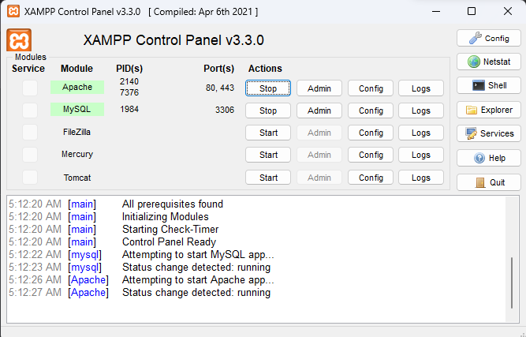
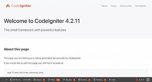
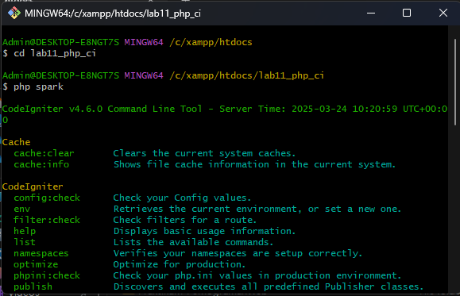
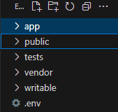
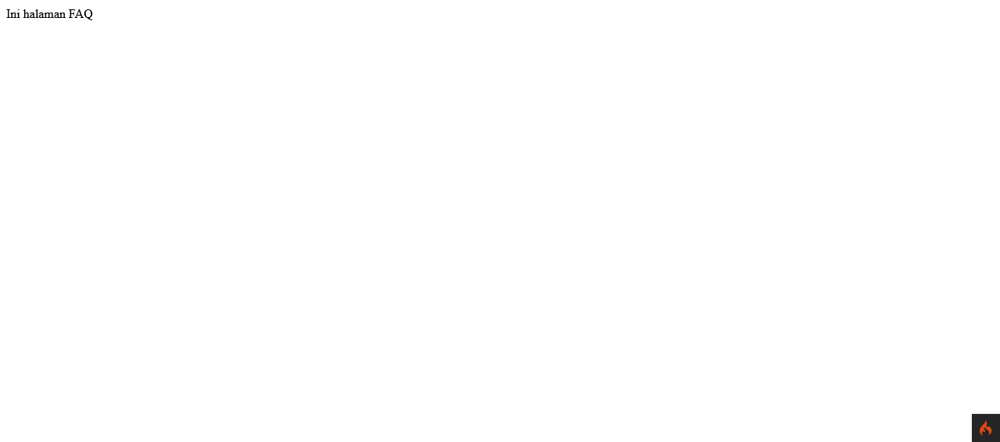
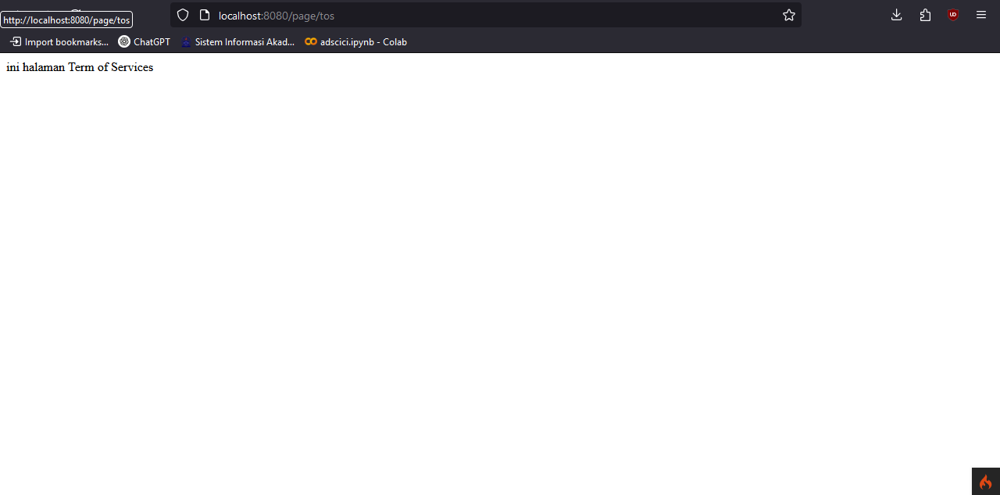
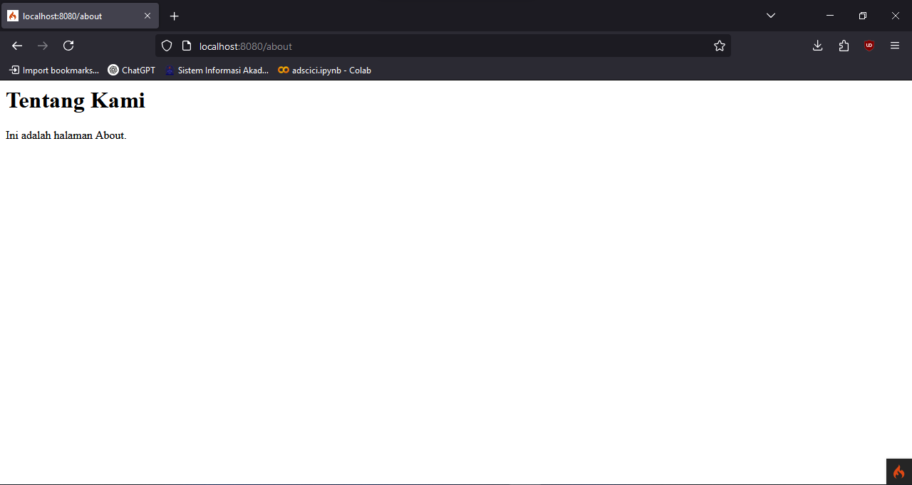
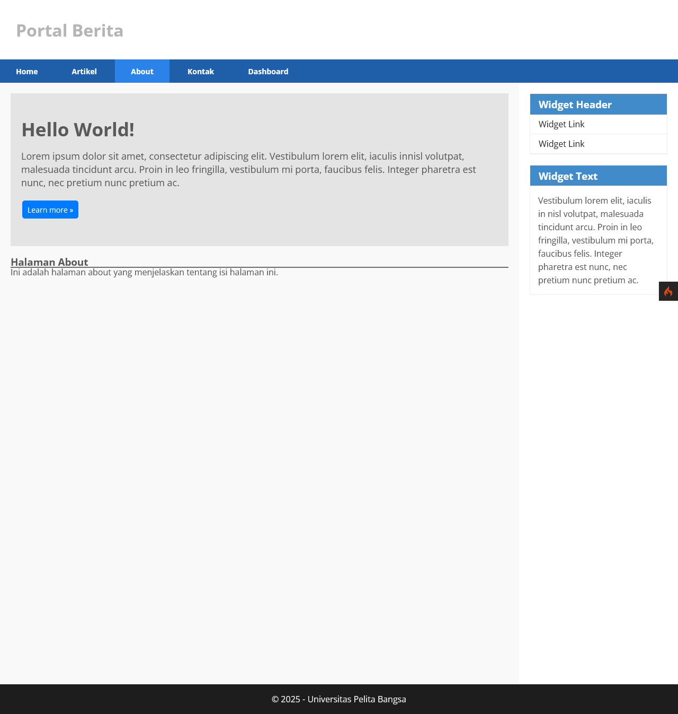
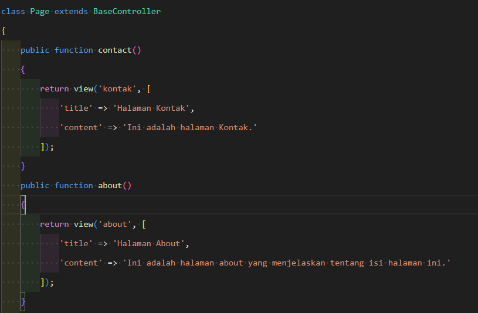
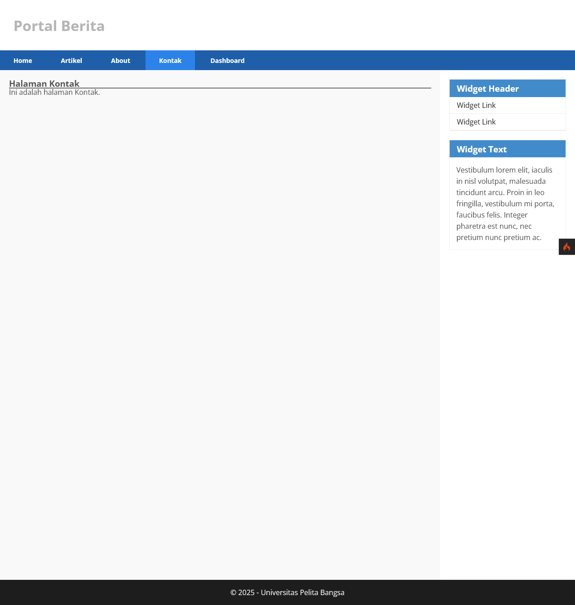

# 📄 **Laporan Praktikum 1 - Pemrograman Web 2**  
### **Framework CodeIgniter 4** 🔥

---

## 🎯 **Tujuan Praktikum**
1. ✅ Memahami konsep dasar **Framework** dalam pengembangan aplikasi web.
2. ✅ Memahami konsep dasar **MVC (Model-View-Controller)** pada Framework CodeIgniter 4.
3. ✅ Mampu menginstalasi dan mengimplementasikan **Framework CodeIgniter 4** dalam membuat aplikasi web sederhana.
4. ✅ Meningkatkan kemampuan dalam menggunakan **Routing, Controller, View**, dan **Layout Template** pada CodeIgniter 4.
5. ✅ Menerapkan **best practice coding** pada pengembangan aplikasi berbasis framework.

---

## 🛠️ **Alat dan Bahan**
### Software 💻
- 🔹 **XAMPP** (PHP >= 7.4)
- 🔹 **Visual Studio Code** (VSCode)
- 🔹 **Git** (optional untuk version control)
- 🔹 **Browser** (Chrome/Firefox/Edge)

### Bahan 📚
- 📂 Framework **CodeIgniter 4**
- 📑 Modul Praktikum Pemrograman Web 2
- 🌐 Koneksi internet (untuk download & referensi)

---

## 📝 **Instruksi Praktikum**
1. 🚀 Pastikan **XAMPP** telah terinstal dan **Apache** berjalan.
2. ✍️ Persiapkan text editor seperti **VSCode**.
3. 📖 Ikuti langkah-langkah praktikum berikut.

---

## 🔧 **Langkah-Langkah Praktikum**

### 1.1 ⚙️ **Persiapan Lingkungan**
- **Aktifkan ekstensi PHP yang dibutuhkan**:
  - ✅ `php-json`
  - ✅ `php-mysqlnd`
  - ✅ `php-xml`
  - ✅ `php-intl`
  - ✅ `extension=zip` (optional untuk php versi 8++)
  - ✅ `libcurl` (optional)

📝 **Langkah:**
1. Buka **XAMPP Control Panel** → `Config` → `PHP (php.ini)`.
2. Cari ekstensi yang dibutuhkan, hilangkan `;` di depannya.
3. Save dan **restart Apache**.

⚠️ **Catatan Penting**:
- Pastikan **tidak ada error** saat Apache di-restart.
- PHP minimal versi **7.4**.

---

### 1.2 📥 **Instalasi CodeIgniter 4**
1. Download dari [👉 CodeIgniter Download](https://codeigniter.com/download)
2. Ekstrak ke `htdocs`
3. Rename folder jadi `lab11_php_ci`

🌐 **Akses awal**:  
`http://localhost/lab11_php_ci/public`  
➡️ Pastikan muncul halaman **"Welcome to CodeIgniter 4!"**



---

### 1.3 💻 **Menjalankan CLI CodeIgniter 4**
- Buka **Command Prompt/Terminal**  
- Masuk ke direktori `htdocs`  
  ```bash
  cd xampp/htdocs/lab11_php_ci
  ```  
- Jalankan command:  
  ```bash
  php spark
  ```  
➡️ Tampil daftar command CLI CI4




---

### 1.4 🐞 **Mengaktifkan Mode Debugging**
- Rename `env` → `.env`  


- Edit `.env`:
  ```ini
  CI_ENVIRONMENT = development
  ```
  

- Simulasi error: hapus titik koma di `Home.php`

⚠️ **Tujuan**: Debugging akan menampilkan **error details** di browser.

---

### 1.5 📂 **Struktur Direktori CodeIgniter 4**
📁 Struktur folder utama:

- `app/` → Folder aplikasi MVC  
- `public/` → Root akses browser  
- `writable/` → Cache, log, upload  
- `vendor/` → Composer dependencies  
- `tests/` → Unit testing  
- `.env`, `spark` → Env & CLI
 


### 1.6 🏗️ **Memahami Konsep MVC**
🎨 **Model-View-Controller**:
- **Model** → Data & logic bisnis  
- **View** → Tampilan ke user  
- **Controller** → Penghubung Model & View

📝 **Catatan**:  
➡️ Mempermudah maintenance  
➡️ Struktur aplikasi lebih terorganisir  

---

### 1.7 🗺️ **Routing dan Controller**
- Edit `app/Config/Routes.php`:  
  ```php
  $routes->get('/about', 'Page::about');
  $routes->get('/contact', 'Page::contact');
  $routes->get('/faqs', 'Page::faqs');
  ```

- Cek routing:  
  ```bash
  php spark routes
  ```

- Buat controller di `Controllers/Page.php`:
  ```php
  <?php
  namespace App\Controllers;

  class Page extends BaseController
  {
      public function about() { echo "Ini halaman About"; }
      public function contact() { echo "Ini halaman Contact"; }
      public function faqs() { echo "Ini halaman FAQ"; }
  }
  ```

🌐 Akses output di browser:  
- `/faqs`


---

### 1.8 ⚡ **Auto Routing**
- Tambahkan method `tos()` di `Page.php`:
  ```php
  public function tos() { echo "Ini halaman Terms of Service"; }
  ```

- Akses:  
  - `http://localhost:8080/page/tos`


---

### 1.9 🖼️ **Membuat View**
- Buat `about.php` di `Views`:
  ```html
  <h1>Tentang Kami</h1>
  <p>Ini adalah halaman About.</p>
  ```

- Ubah `Page::about()`:
  ```php
  public function about() { return view('about'); }
  ```

📸 **Output**:  


---

### 1.10 🎨 **Membuat Layout Template + CSS**
- Buat `public/style.css`  
- Buat `Views/template/header.php`:
  ```php
  <!DOCTYPE html>
  <html>
  <head>
      <link rel="stylesheet" href="<?= base_url('style.css'); ?>">
  </head>
  <body>
      <header><h1>My Web</h1></header>
      <nav>
          <a href="/Home">FAQs</a>
          <a href="/Artikel">FAQs</a>
          <a href="/About">FAQs</a>
          <a href="/Kontak">About</a> |
          <a href="/Dashboard">Contact</a> |
      </nav>
  ```

- Buat `footer.php`:
  ```php
      <footer><p>&copy; 2025 Web Programming</p></footer>
  </body>
  </html>
  ```

- Gunakan di `about.php`:
  ```php
  <?= view('template/header'); ?>
  <?= view('template/hero'); ?>
  <h1><?= $title; ?></h1>  <!-- dari controller page.php -->
  <hr>
  <p><?= $content; ?></p>
  <?= view('template/footer'); ?>
  ```

📸 **Output**:  


---

### 1.11 ✅ **Menyelesaikan Tugas**
- Tambahkan method di `Page.php`:
  ```php
  public function about() { return view('about'); }
  public function kontak() { return view('kontak'); }
  ```


- Buat file:
  - `artikel.php`
  - `kontak.php`

- Update navigasi `header.php`

📸 **Output**:  



---

## 📚 **Kesimpulan**
- ✅ Framework CodeIgniter 4 memudahkan pembuatan aplikasi web berbasis **MVC**.
- ✅ Fitur **Routing, Controller, View** serta **Template Layout** membuat pengembangan lebih cepat & rapi.
- ✅ Praktikum ini melatih penggunaan dasar CI4 yang esensial bagi pengembangan web modern.

---

## 🚧 **Kendala & Solusi**
| ⚠️ **Kendala**                        | ✅ **Solusi**                                              |
|---------------------------------------|------------------------------------------------------------|
| Apache gagal running di XAMPP         | Tutup aplikasi lain yg pakai port 80 (Skype/IIS).         |
| Route baru tidak bisa diakses         | Pastikan routing benar & controller sesuai di `Routes.php` |
| Auto Routing tidak aktif              | Enable Auto Routing di `app/Config/Feature.php`           |
| `.env` tidak muncul di VSCode         | Aktifkan `Show Hidden Files` di VSCode/File Explorer      |

---

## 🔗 **Referensi**
1. [📘 Dokumentasi CodeIgniter 4](https://codeigniter.com/user_guide/)
2. 📒 Modul Praktikum Pemrograman Web 2  
3. [PHP Manual](https://www.php.net/manual/en/)  
4. [XAMPP for Windows](https://www.apachefriends.org/index.html)

---

# 📄 **Laporan Praktikum 2 - Pemrograman Web 2**  
