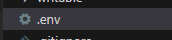
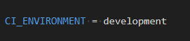
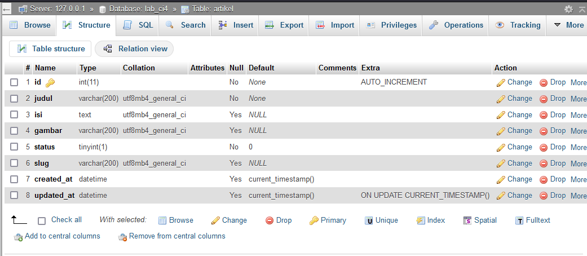
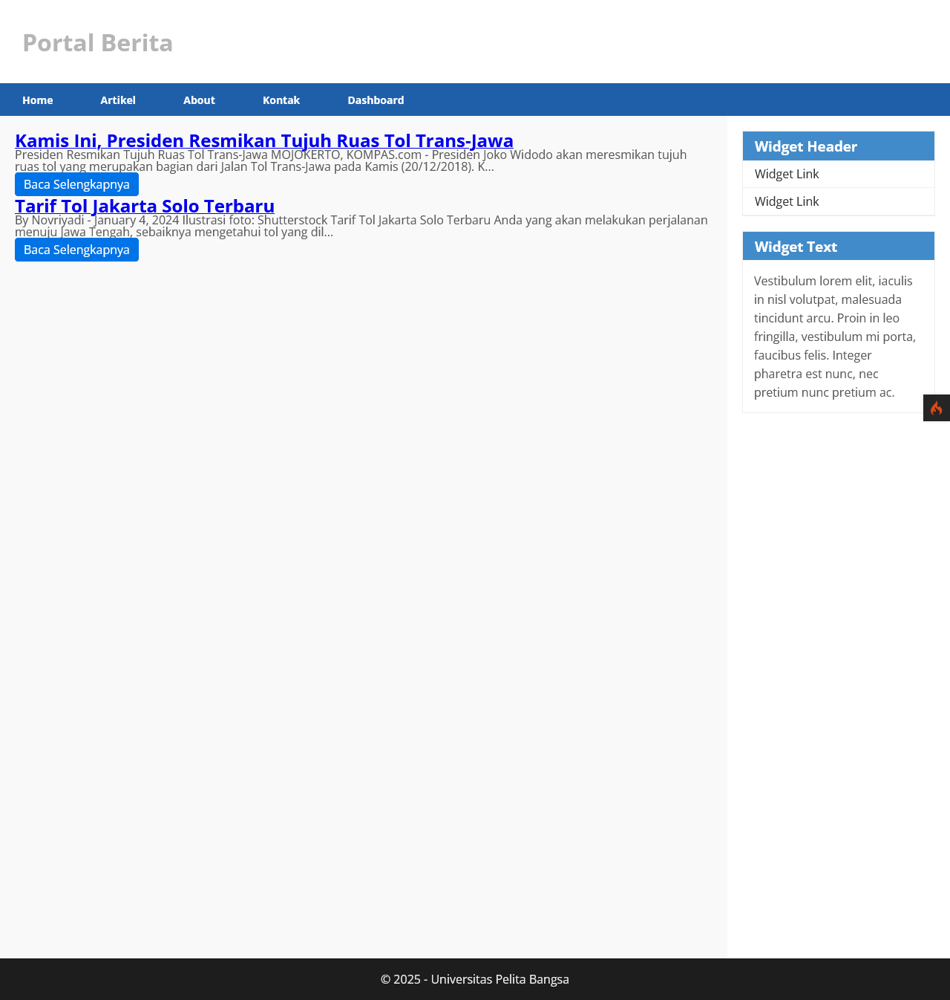
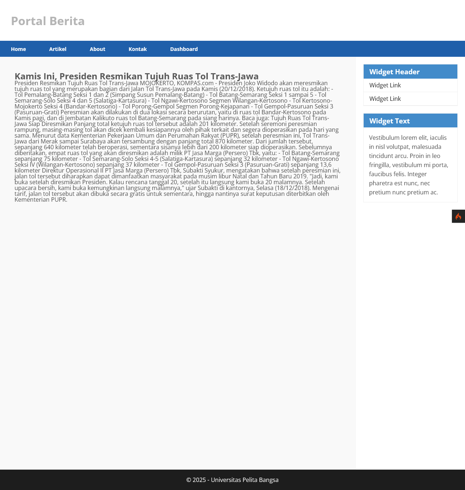
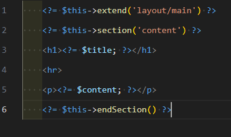
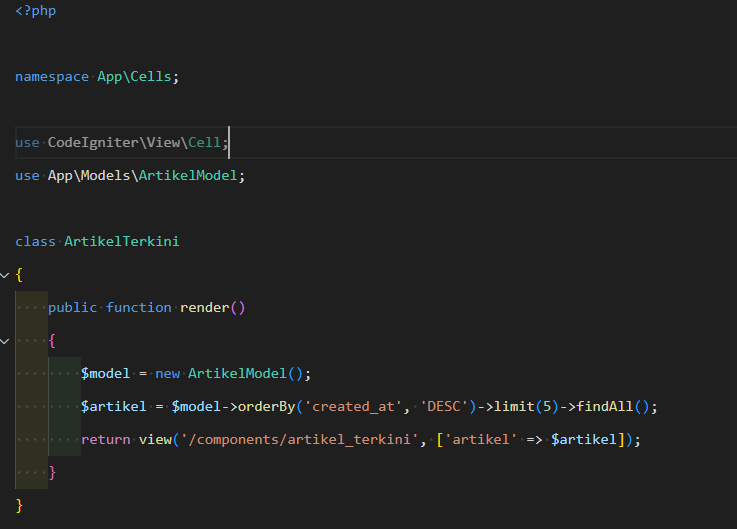
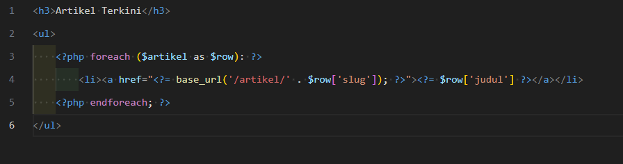
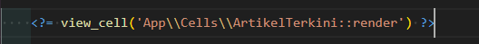

# 📖 Daftar Isi  
1️⃣ [**Praktikum 1**](#-laporan-praktikum-1---pemrograman-web-2) - instalasi & setup code igniter 
2️⃣ [**Praktikum 2**](#-laporan-praktikum-2---pemrograman-web-2) - Membuat CRUD  
3️⃣ [**Praktikum 3**](#praktikum-3-view-layout-dan-view-cell-️) - Membuat View Layout dan artikel terkini menggunakan View Cell


# 📄 **Laporan Praktikum 1 - Pemrograman Web 2**  

---

## 🎯 **Tujuan Praktikum**
1. ✅ Memahami konsep dasar **Framework** dalam pengembangan aplikasi web.
2. ✅ Memahami konsep dasar **MVC (Model-View-Controller)** pada Framework CodeIgniter 4.
3. ✅ Mampu menginstalasi dan mengimplementasikan **Framework CodeIgniter 4** dalam membuat aplikasi web sederhana.
4. ✅ Meningkatkan kemampuan dalam menggunakan **Routing, Controller, View**, dan **Layout Template** pada CodeIgniter 4.
5. ✅ Menerapkan **best practice coding** pada pengembangan aplikasi berbasis framework.

---

## 🛠️ **Alat dan Bahan**
### Software 💻
- 🔹 **XAMPP** (PHP >= 7.4)
- 🔹 **Visual Studio Code** (VSCode)
- 🔹 **Git** (optional untuk version control)
- 🔹 **Browser** (Chrome/Firefox/Edge)

### Bahan 📚
- 📂 Framework **CodeIgniter 4**
- 📑 Modul Praktikum Pemrograman Web 2
- 🌐 Koneksi internet (untuk download & referensi)

---

## 📝 **Instruksi Praktikum**
1. 🚀 Pastikan **XAMPP** telah terinstal dan **Apache** berjalan.
2. ✍️ Persiapkan text editor seperti **VSCode**.
3. 📖 Ikuti langkah-langkah praktikum berikut.

---

## 🔧 **Langkah-Langkah Praktikum**

### 1.1 ⚙️ **Persiapan Lingkungan**
- **Aktifkan ekstensi PHP yang dibutuhkan**:
  - ✅ `php-json`
  - ✅ `php-mysqlnd`
  - ✅ `php-xml`
  - ✅ `php-intl`
  - ✅ `extension=zip` (optional untuk php versi 8++)
  - ✅ `libcurl` (optional)

📝 **Langkah:**
1. Buka **XAMPP Control Panel** → `Config` → `PHP (php.ini)`.
2. Cari ekstensi yang dibutuhkan, hilangkan `;` di depannya.
3. Save dan **restart Apache**.

⚠️ **Catatan Penting**:
- Pastikan **tidak ada error** saat Apache di-restart.
- PHP minimal versi **7.4**.

---

### 1.2 📥 **Instalasi CodeIgniter 4**
1. Download dari [👉 CodeIgniter Download](https://codeigniter.com/download)
2. Ekstrak ke `htdocs`
3. Rename folder jadi `lab11_php_ci`

🌐 **Akses awal**:  
`http://localhost/lab11_php_ci/public`  
➡️ Pastikan muncul halaman **"Welcome to CodeIgniter 4!"**


---

### 1.3 💻 **Menjalankan CLI CodeIgniter 4**
- Buka **Command Prompt/Terminal**  
- Masuk ke direktori `htdocs`  
  ```bash
  cd xampp/htdocs/lab11_php_ci
  ```  
- Jalankan command:  
  ```bash
  php spark
  ```  
➡️ Tampil daftar command CLI CI4


---

### 1.4 🐞 **Mengaktifkan Mode Debugging**
- Rename `env` → `.env`  


- Edit `.env`:
  ```ini
  CI_ENVIRONMENT = development
  ```
  

- Simulasi error: hapus titik koma di `Home.php`

⚠️ **Tujuan**: Debugging akan menampilkan **error details** di browser.

---

### 1.5 📂 **Struktur Direktori CodeIgniter 4**
📁 Struktur folder utama:

- `app/` → Folder aplikasi MVC  
- `public/` → Root akses browser  
- `writable/` → Cache, log, upload  
- `vendor/` → Composer dependencies  
- `tests/` → Unit testing  
- `.env`, `spark` → Env & CLI
 


### 1.6 🏗️ **Memahami Konsep MVC**
🎨 **Model-View-Controller**:
- **Model** → Data & logic bisnis  
- **View** → Tampilan ke user  
- **Controller** → Penghubung Model & View

📝 **Catatan**:  
➡️ Mempermudah maintenance  
➡️ Struktur aplikasi lebih terorganisir  

---

### 1.7 🗺️ **Routing dan Controller**
- Edit `app/Config/Routes.php`:  
  ```php
  $routes->get('/about', 'Page::about');
  $routes->get('/contact', 'Page::contact');
  $routes->get('/faqs', 'Page::faqs');
  ```

- Cek routing:  
  ```bash
  php spark routes
  ```

- Buat controller di `Controllers/Page.php`:
  ```php
  <?php
  namespace App\Controllers;

  class Page extends BaseController
  {
      public function about() { echo "Ini halaman About"; }
      public function contact() { echo "Ini halaman Contact"; }
      public function faqs() { echo "Ini halaman FAQ"; }
  }
  ```

🌐 Akses output di browser:  
- `/faqs`


---

### 1.8 ⚡ **Auto Routing**
- Tambahkan method `tos()` di `Page.php`:
  ```php
  public function tos() { echo "Ini halaman Terms of Service"; }
  ```

- Akses:  
  - `http://localhost:8080/page/tos`


---

### 1.9 🖼️ **Membuat View**
- Buat `about.php` di `Views`:
  ```html
  <h1>Tentang Kami</h1>
  <p>Ini adalah halaman About.</p>
  ```

- Ubah `Page::about()`:
  ```php
  public function about() { return view('about'); }
  ```

📸 **Output**:  


---

### 1.10 🎨 **Membuat Layout Template + CSS**
- Buat `public/style.css`  
- Buat `Views/template/header.php`:
  ```php
  <!DOCTYPE html>
  <html>
  <head>
      <link rel="stylesheet" href="<?= base_url('style.css'); ?>">
  </head>
  <body>
      <header><h1>My Web</h1></header>
      <nav>
          <a href="/Home">Home</a>
          <a href="/Artikel">Artikel</a>
          <a href="/About">About</a>
          <a href="/Kontak">About</a> |
          <a href="/Dashboard">Contact</a> |
      </nav>
  ```

- Buat `footer.php`:
  ```php
      <footer><p>&copy; 2025 Web Programming</p></footer>
  </body>
  </html>
  ```

- Gunakan di `about.php`:
  ```php
  <?= view('template/header'); ?>
  <?= view('template/hero'); ?>
  <h1><?= $title; ?></h1>  <!-- dari controller page.php -->
  <hr>
  <p><?= $content; ?></p>
  <?= view('template/footer'); ?>
  ```

📸 **Output**:  
<p align="center">

</p>
---

### 1.11 ✅ **Menyelesaikan Tugas**
- Tambahkan method di `Page.php`:
  ```php
  public function about() { return view('about'); }
  public function kontak() { return view('kontak'); }
  ```


- Buat file:
  - `about.php`
  - `kontak.php`

- Update navigasi `header.php`

📸 **Output**:  


---

## 📚 **Kesimpulan**
- ✅ Framework CodeIgniter 4 memudahkan pembuatan aplikasi web berbasis **MVC**.
- ✅ Fitur **Routing, Controller, View** serta **Template Layout** membuat pengembangan lebih cepat & rapi.
- ✅ Praktikum ini melatih penggunaan dasar CI4 yang esensial bagi pengembangan web modern.

---

## 🚧 **Kendala & Solusi**
| ⚠️ **Kendala**                        | ✅ **Solusi**                                              |
|---------------------------------------|------------------------------------------------------------|
| Apache gagal running di XAMPP         | Tutup aplikasi lain yg pakai port 80 (Skype/IIS).         |
| Route baru tidak bisa diakses         | Pastikan routing benar & controller sesuai di `Routes.php` |
| Auto Routing tidak aktif              | Enable Auto Routing di `app/Config/Feature.php`           |
| `.env` tidak muncul di VSCode         | Aktifkan `Show Hidden Files` di VSCode/File Explorer      |

---

## 🔗 **Referensi**
1. [📘 Dokumentasi CodeIgniter 4](https://codeigniter.com/user_guide/)
2. 📒 Modul Praktikum Pemrograman Web 2  
3. [PHP Manual](https://www.php.net/manual/en/)  
4. [XAMPP for Windows](https://www.apachefriends.org/index.html)

---

# 📄 **Laporan Praktikum 2 - Pemrograman Web 2**  

---

## 🎯 **Tujuan Praktikum**
1. ✅ Memahami konsep dasar **Model** pada CodeIgniter 4.
2. ✅ Memahami konsep dasar **CRUD (Create, Read, Update, Delete)**.
3. ✅ Mampu membuat **aplikasi sederhana** menggunakan CRUD di **CodeIgniter 4**.
4. ✅ Menghubungkan aplikasi dengan **database MySQL**.
5. ✅ Menerapkan **best practice coding** untuk CRUD.

---

## 🛠️ **Alat dan Bahan**
### Software 💻
- 🔹 **XAMPP** (PHP >= 7.4)
- 🔹 **Visual Studio Code** (VSCode)
- 🔹 **MySQL Database** (dari XAMPP)
- 🔹 **Git** (optional untuk version control)
- 🔹 **Browser** (Chrome/Firefox/Edge)

### Bahan 📚
- 📂 **Framework CodeIgniter 4**
- 📑 **Modul Praktikum 2**
- 🌐 **Koneksi internet** (untuk download & referensi)

---

## 📝 **Instruksi Praktikum**
1. 🚀 Pastikan **XAMPP** telah terinstal dan **Apache + MySQL** berjalan.
2. ✍️ Pastikan **CodeIgniter 4** telah diinstal di `htdocs/lab11_php_ci`.
3. 📖 Ikuti langkah-langkah praktikum berikut.

---

## 🔧 **Langkah-Langkah Praktikum**

### 2.1 📂 **Persiapan Database MySQL**
- **Jalankan MySQL di XAMPP**.
- **Buat database baru** dengan nama `lab_ci4`:
  ```sql
  CREATE DATABASE lab_ci4;
  ```
- **Buat tabel artikel** dengan struktur berikut:
  ```sql
  CREATE TABLE artikel (
      id INT(11) AUTO_INCREMENT,
      judul VARCHAR(200) NOT NULL,
      isi TEXT NULL,
      gambar VARCHAR(200) NULL,
      status TINYINT(1) NOT NULL DEFAULT 0,
      slug VARCHAR(200) NULL,
      PRIMARY KEY(id)
      created_at DATETIME DEFAULT CURRENT_TIMESTAMP,
      updated_at DATETIME DEFAULT CURRENT_TIMESTAMP ON UPDATE CURRENT_TIMESTAMP
  );
  ```
- **Cek database** di phpMyAdmin.
  

---

### 2.2 🔗 **Konfigurasi Koneksi Database**
- **Buka file `.env` di CodeIgniter 4**.
- **Edit bagian database**:
  ```ini
  database.default.hostname = localhost
  database.default.database = lab_ci4
  database.default.username = root
  database.default.password =
  database.default.DBDriver = MySQLi
  ```
- **Simpan perubahan** dan restart server.

---

### 2.3 🏗️ **Membuat Model**
- **Buat file baru `ArtikelModel.php` di `app/Models/`**:
  ```php
  <?php
  namespace App\Models;
  use CodeIgniter\Model;
  
  class ArtikelModel extends Model
  {
      protected $table = 'artikel';
      protected $primaryKey = 'id';
      protected $useAutoIncrement = true;
      protected $allowedFields = [
        'judul',
        'isi',
        'status',
        'slug',
        'gambar',
        'created_at',
        'updated_at',
    ];
  }
  ```

---

### 2.4 🎯 **Membuat Controller CRUD**
- **Buat file `Artikel.php` di `app/Controllers/`**:
  ```php
  <?php
  namespace App\Controllers;
  use App\Models\ArtikelModel;
  
  class Artikel extends BaseController
  {
      public function index()
      {
          $model = new ArtikelModel();
          $artikel = $model->findAll();
          return view('artikel/index', compact('artikel'));
      }
  }
  ```
  
---

### 2.5 🖼️ **Membuat View Index**
- **Buat folder `artikel/` di `app/Views/`**.
- **Buat file `index.php`**:
  ```php
    <?= $this->include('template/header'); ?>
    <section id="content">
  ```
  * Fungsi: Memasukkan file header.php yang biasanya berisi metadata, stylesheet, dan navigasi.
  * `<section id="content">`: Menjadi wadah utama untuk menampilkan daftar artikel.

  ```php
        <?php if ($artikel): ?>
            <?php foreach ($artikel as $row): ?>
                <article class="entry">
                    <!-- Judul dengan link -->
                    <h2>
                        <a href="<?= base_url('/artikel/' . $row['slug']); ?>">
                            <?= esc($row['judul']); ?>
                        </a>
                    </h2>
                    <!-- Cek gambar -->
                    <?php if (!empty($row['gambar'])): ?>
                        " alt="<?= esc($row['judul']); ?>" style="max-width: 100%; height: auto;">
                    <?php endif; ?>
                    <!-- Cuplikan isi -->
                    <p>
                        <?= esc(substr(strip_tags($row['isi']), 0, 200)); ?>...
                    </p>
                    <!-- Tombol Baca Selengkapnya -->
                    <a href="<?= base_url('/artikel/' . $row['slug']); ?>" class="read-more">Baca Selengkapnya</a>
                </article>
                <!-- <hr class="divider" /> -->
            <?php endforeach; ?>
        <?php else: ?>
            <article class="entry">
                <h2>Tidak ada artikel yang tersedia.</h2>
            </article>
            <?php endif; ?>
    </section>
  ```
  * Cek apakah `$artikel` memiliki data, jika ada maka dilakukan looping.
  * Menampilkan judul artikel dalam tag `<h2>` dengan link ke halaman detail.
  * Cek apakah ada gambar, jika ada maka ditampilkan.
  * Menampilkan cuplikan isi artikel (200 karakter pertama).
  * Tombol "Baca Selengkapnya" untuk membuka artikel secara penuh.
  * Jika `$artikel` kosong, tampilkan pesan "Tidak ada artikel yang tersedia."

  ```php  
    <?= $this->include('template/footer'); ?>
  ```
  * Memasukkan file footer.php yang biasanya berisi informasi tambahan, hak cipta, dan script JavaScript.


---

### 2.6 📥 **Insert Data Artikel ke Database**
- **Jalankan query berikut di phpMyAdmin:**
  ```sql
  INSERT INTO artikel (judul, isi, slug) VALUES
  ('Artikel Pertama', 'Isi artikel pertama...', 'artikel-pertama'),
  ('Artikel Kedua', 'Isi artikel kedua...', 'artikel-kedua');
  ```
- **Akses URL:** `http://localhost:8080/artikel`
- **Pastikan data tampil di halaman.**


---

### 2.7 📝 **Membuat Halaman Detail Artikel**
- **Tambahkan method `view()` di Controller `Artikel.php`**:
  ```php
    public function view($slug)
    {
        $model = new ArtikelModel();
        $artikel = $model->where([
            'slug' => $slug
        ])->first();
        // Menampilkan error apabila data tidak ada.
        if (!$artikel) {
            throw PageNotFoundException::forPageNotFound();
        }
        $title = $artikel['judul'];
        return view('artikel/detail', compact('artikel', 'title'));
    }
  ```
    1. **Membuat instance model**  
      - Fungsi membuat objek dari `ArtikelModel` untuk mengakses data artikel dalam database.  

    2. **Mencari artikel berdasarkan slug**  
      - Menggunakan metode `where(['slug' => $slug])->first()` untuk mengambil satu artikel yang sesuai dengan slug yang diberikan.  

    3. **Mengecek apakah artikel ditemukan**  
      - Jika artikel tidak ditemukan (`null`), fungsi akan melemparkan `PageNotFoundException::forPageNotFound()`, yang menampilkan halaman error 404.  

    4. **Menyiapkan judul halaman**  
      - Jika artikel ditemukan, variabel `$title` diisi dengan nilai `judul` dari artikel tersebut.  

    5. **Menampilkan halaman detail artikel**  
      - Fungsi `view('artikel/detail', compact('artikel', 'title'))` digunakan untuk me-render halaman detail artikel dan mengirimkan data artikel serta judul ke dalam view.

- **Buat file `detail.php` di `Views/artikel/`**:
  ```php
  <?= $this->include('template/header'); ?>
    <main class="container" style="padding: 20px;">
        <article class="entry">
            <h2><?= esc($artikel['judul']); ?></h2>
            <?php if (!empty($artikel['gambar'])) : ?>
                "
                    alt="<?= esc($artikel['judul']); ?>"
                    style="max-width: 100%; height: auto; margin: 20px 0;">
            <?php endif; ?>
            <div class="content">
                <p><?= esc($artikel['isi']); ?></p>
            </div>
        </article>
    </main>
  <?= $this->include('template/footer'); ?>
  ```
    1. **Menyertakan Header**  
      - `<?= $this->include('template/header'); ?>` digunakan untuk memasukkan file `header.php`, yang biasanya berisi elemen navigasi dan metadata halaman.  

    2. **Membuat Container Utama**  
      - `<main class="container" style="padding: 20px;">` membuat elemen `<main>` sebagai wadah utama dengan padding 20px agar tampilan lebih rapi.  

    3. **Menampilkan Judul Artikel**  
      - `<h2><?= esc($artikel['judul']); ?></h2>` menampilkan judul artikel dengan metode `esc()` untuk mencegah serangan XSS (Cross-Site Scripting).  

    4. **Menampilkan Gambar Jika Ada**  
      - `if (!empty($artikel['gambar']))` → Mengecek apakah artikel memiliki gambar.  
      - Jika ada, gambar akan ditampilkan dengan `img src="<?= base_url('gambar/' . esc($artikel['gambar'], 'url')); ?>"`, yang mengambil gambar dari folder `/gambar/` berdasarkan nama file yang tersimpan di database.  
      - Gambar diberikan style `max-width: 100%; height: auto; margin: 20px 0;` agar responsif dan memiliki jarak yang cukup dari elemen lainnya.  

    5. **Menampilkan Isi Artikel**  
      - `<div class="content">` digunakan sebagai pembungkus isi artikel.  
      - `<p><?= esc($artikel['isi']); ?></p>` menampilkan isi artikel dengan `esc()` untuk mencegah input berbahaya.  

    6. **Menyertakan Footer**  
      - `<?= $this->include('template/footer'); ?>` digunakan untuk menyertakan `footer.php`, yang biasanya berisi informasi tambahan atau script JavaScript.




---

## ✅ **Kesimpulan**
- 🚀 CRUD memungkinkan **manajemen data** dalam aplikasi web.
- ✅ CodeIgniter 4 menyediakan **Model, Controller, dan View** untuk memudahkan pengembangan CRUD.
- ✅ Dengan konsep MVC, struktur kode menjadi lebih **modular dan terorganisir**.

---

## 🚧 **Kendala & Solusi**
| ⚠️ **Kendala** | ✅ **Solusi** |
|----------------|-------------|
| Data tidak muncul di halaman | Pastikan database sudah terhubung di `.env` |
| Query error saat insert | Pastikan format SQL benar |
| Controller tidak terdeteksi | Pastikan file berada di `app/Controllers/` |

---


# Praktikum 3: View Layout dan View Cell 🎨🛠️

### 1️⃣ Membuat Layout Utama 🏗️
Buat folder **layout** di dalam `app/Views/`, lalu buat file `main.php` dengan kode berikut:

```php
    <!DOCTYPE html>
    <html lang="en">
    <head>
        <meta charset="UTF-8">
        <title><?= $title ?? 'My Website' ?></title>
        <link rel="stylesheet" href="<?= base_url('/style.css'); ?>">
    </head>
    <body>
        <div id="container">
            <header>
                <h1>Layout Sederhana</h1>
            </header>
            <nav>
                <a href="<?= base_url('/'); ?>" class="active">Home</a>
                <a href="<?= base_url('/artikel'); ?>">Artikel</a>
                <a href="<?= base_url('/about'); ?>">About</a>
                <a href="<?= base_url('/contact'); ?>">Kontak</a>
            </nav>
            <section id="wrapper">
                <section id="main">
                    <?= $this->renderSection('content') ?>
                </section>
                <aside id="sidebar">
                    <?= view_cell('App\\Cells\\ArtikelTerkini::render') ?>
                </aside>
            </section>
            <footer>
                <p>&copy; 2021 - Universitas Pelita Bangsa</p>
            </footer>
        </div>
    </body>
    </html>
```

---

### 2️⃣ Modifikasi File View 📄
Ubah file `app/Views/home.php` agar sesuai dengan layout baru:


Sesuaikan juga halaman lain agar menggunakan layout yang baru.  

---

### 3️⃣ Menampilkan Data Dinamis dengan View Cell 🏷️

**View Cell** digunakan untuk menampilkan komponen UI yang bisa digunakan ulang. Contoh yang sering digunakan adalah sidebar, widget, atau menu navigasi.

#### 🏗️ Membuat Class View Cell
1. Buat folder **Cells** di dalam `app/`.
2. Buat file `ArtikelTerkini.php` di dalam `app/Cells/` dengan kode berikut:



#### 📄 Membuat View untuk View Cell
1. Buat folder **components** di dalam `app/Views/`.
2. Buat file `artikel_terkini.php` di dalam `app/Views/components/` dengan kode berikut:
3. panggil di dalam layout/main.php

**📄 Source code `app/Views/components/`**


**📞 Panggil view cell ke dalam `layout/main.php`**



# 📌 Jawaban dari Pertanyaan Praktikum 3
#### ✅ **Manfaat Utama dari Penggunaan View Layout**  
**View Layout** dalam CodeIgniter 4 berfungsi sebagai template utama yang dapat digunakan kembali di berbagai halaman. Manfaat utamanya:  
1. **Konsistensi UI/UX** 🖥️ – Semua halaman memiliki tampilan yang seragam.  
2. **Efisiensi Kode** ⏳ – Menghindari duplikasi kode dengan menggunakan satu layout untuk banyak halaman.  
3. **Mudah Dikelola** 📂 – Jika ada perubahan desain, cukup edit satu file layout.  
4. **Pemisahan Logika dan Tampilan** 🎭 – Mempermudah maintenance dan debugging. 

---

#### ✅ **Perbedaan antara View Cell dan View Biasa**  
| **Aspek**        | **View Biasa** | **View Cell** |
|------------------|---------------|--------------|
| **Cara Pemanggilan** | Dipanggil langsung dari controller dengan `return view()` | Dipanggil dengan helper `view_cell()` di dalam [views/layout/main.php](#-membuat-view-untuk-view-cell) |
| **Penggunaan Data** | Data dikirim melalui parameter kedua `return view('file', $data)` | Menggunakan method dalam class terpisah |
| **Fleksibilitas** | Kurang fleksibel karena perlu memuat seluruh View | Lebih modular, bisa digunakan di berbagai tempat |
| **Kinerja** | Bisa lebih berat jika banyak data yang diproses | Lebih ringan untuk komponen kecil yang sering digunakan |

---

## Penyesuaian Terakhir


---

✨ Code sudah selesai dan bisa diterapkan pada projek 🚀🎉


## 🔗 **Referensi**
1. [📘 Dokumentasi CodeIgniter 4](https://codeigniter.com/user_guide/)
2. 📒 Modul Praktikum Pemrograman Web 2  
3. [PHP MySQL Manual](https://www.php.net/manual/en/book.mysqli.php)

---

